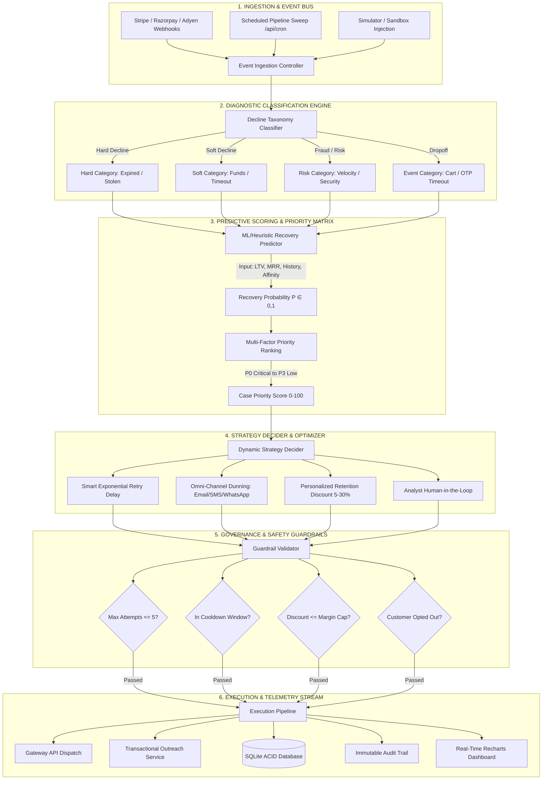
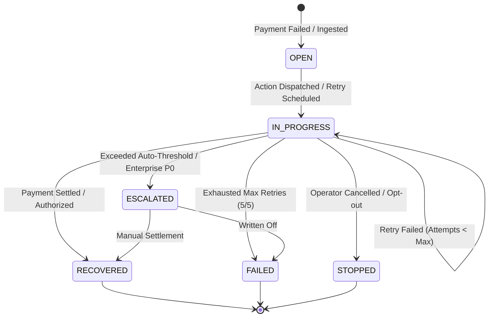

# Recovr — Autonomous Revenue Recovery & Payment Orchestration Engine
## Comprehensive System Architecture, Workflow Logic & Jury Presentation Dossier

---

## 🎯 Executive Summary & Problem Space

### The Multi-Billion Dollar Problem
- **\$440B+** in SaaS and subscription revenue is lost annually due to **involuntary churn**.
- **Causes of Failed Payments**:
  - **Soft Declines (62%)**: Transient insufficient funds, daily velocity limits, network timeouts, bank processing errors.
  - **Hard Declines (26%)**: Expired cards, lost/stolen tokens, invalid routing numbers, closed accounts.
  - **Customer Behavioral Dropoffs (12%)**: Cart/checkout timeouts, 3DS OTP dropoffs, unrenewed mandate authorizations.
- **The Failure of Traditional Dunning**:
  - Naive systems retry charges at fixed 24-hour intervals, triggering card network fraud blocks.
  - Static email dunning sends impersonal, generic "Payment Failed" spam, leading to high opt-outs and brand damage.
  - Zero economic awareness: Retrying a \$10 customer the same way as a \$10,000 enterprise account.

### The Recovr Solution
Recovr is an **Autonomous Payment Orchestration & Recovery Agent** that pairs deterministic gateway decline taxonomy with real-time economic scoring to execute self-healing, multi-channel recovery workflows with zero human intervention required.

---

## 🏛️ End-to-End System Architecture

---

## 🧮 Mathematical Formulations & Decision Logic

### 1. Recovery Probability Formulation ($P_{\text{rec}}$)

$$P_{\text{rec}} = \text{clamp}\left( B_{\text{cat}} \times \alpha_{\text{history}} \times \beta_{\text{tenure}} \times (1 - \lambda \cdot n_{\text{attempts}}), 0.05, 0.98 \right)$$

Where:
- $B_{\text{cat}}$: Base category probability ($\text{Soft} = 0.85$, $\text{Event} = 0.70$, $\text{Hard} = 0.35$, $\text{Fraud} = 0.10$).
- $\alpha_{\text{history}} = \frac{\text{Successful Payments}}{\text{Total Historical Payments}}$: Customer reliability coefficient.
- $\beta_{\text{tenure}} = 1 + \min\left(0.15, \frac{\text{Tenure (Days)}}{365} \times 0.1\right)$: Loyalty multiplier.
- $n_{\text{attempts}}$: Number of retries already executed ($\lambda = 0.12$ degradation per attempt).

---

### 2. Multi-Factor Priority Score ($S_{\text{priority}}$)

$$S_{\text{priority}} = \min\left(100, \left( \omega_1 \cdot \frac{A_{\text{risk}}}{A_{\text{max}}} + \omega_2 \cdot P_{\text{rec}} + \omega_3 \cdot \frac{\text{LTV}}{\text{LTV}_{\text{benchmark}}} + \omega_4 \cdot U \right) \times 100\right)$$

Where:
- $A_{\text{risk}}$: Amount at risk for the invoice.
- $U = e^{-\gamma \cdot t_{\text{elapsed}}}$: Time-urgency decay factor.
- Weights: $\omega_1 = 0.35$ (Exposure), $\omega_2 = 0.25$ (Feasibility), $\omega_3 = 0.25$ (Customer Value), $\omega_4 = 0.15$ (Urgency).

---

### 3. Smart Retry Backoff with Jitter

$$T_{\text{next}} = T_{\text{now}} + \Delta_{\text{base}} \times 2^{(n - 1)} \pm \text{Uniform}(0, \text{Jitter})$$

- **Soft Declines**: Retries scheduled during bank settlement windows (e.g. 06:00–09:00 local time).
- **Payday Scheduling**: Aligns retries with end-of-month and 1st/15th salary deposit cycles.

---

## 🔄 State Machine & Case Lifecycle

---

## 📡 REST API Specifications

| Endpoint | Method | Latency | Request Body / Query | Success Response | Description |
| :--- | :--- | :--- | :--- | :--- | :--- |
| `/api/dashboard` | `GET` | `< 25ms` | None | `{ totalRevenue, revenueAtRisk, revenueRecovered, recoveryRate, recoveryTrend, failureReasons, statusBreakdown, recentCases }` | Aggregated executive telemetry & chart feeds |
| `/api/cases` | `GET` | `< 30ms` | `?status=&sortBy=&search=` | `{ total, page, limit, cases: [...] }` | Filterable triage queue with score sorting |
| `/api/cases/[id]` | `GET` | `< 15ms` | URL Param: `id` | `{ case, customer, actions, auditEntries, payment, subscription }` | Complete 360° case diagnostic workbench |
| `/api/cases/[id]` | `PATCH` | `< 45ms` | `{ action: "approve"\|"execute"\|"escalate"\|"stop", customDiscount?, tone?, notes? }` | `{ success: true, caseId, actionId, status }` | Manual operator override & intervention trigger |
| `/api/customers` | `GET` | `< 20ms` | `?search=&sortBy=` | `{ total, customers: [...] }` | Subscriber portfolio with churn risk scores |
| `/api/customers/[id]` | `GET` | `< 15ms` | URL Param: `id` | `{ customer, paymentHistory, recoveryCases, stats }` | Customer lifetime value & historical reliability |
| `/api/simulator` | `POST` | `< 60ms` | `{ command: "seed"\|"trigger_scenario"\|"bulk_scenarios"\|"simulate_recovery", params: {} }` | `{ success: true, case?: {}, count?: number }` | Synthetic decline injector & test bench |
| `/api/cron` | `GET` | `< 80ms` | None | `{ success: true, processedCases, actionsExecuted, recoveredTotal }` | Scheduled pipeline evaluation sweep |
| `/api/audit` | `GET` | `< 20ms` | `?entity_type=&limit=` | `{ total, entries: [...] }` | Immutable compliance audit stream |
| `/api/webhooks` | `POST` | `< 35ms` | `{ event: "charge.failed", payload: {...} }` | `{ received: true, caseId }` | Gateway event ingestion controller |

---

## 🛡️ Enterprise Safety Guardrails & Compliance

1. **Strict Velocity & Attempt Caps**: Hard limit of **5 recovery attempts** per billing cycle to prevent payment processor velocity flags and interchange penalties.
2. **Cooldown Windows**: Mandatory minimum interval of 12 hours between automated card charges.
3. **Margin-Preserving Discount Caps**: Automated courtesy concessions capped at **30% max**, modulated dynamically by customer MRR margin.
4. **Do-Not-Disturb & Opt-Out Compliance**: Customers marked as `opted_out` immediately bypass automated outreach and route directly to account managers.
5. **ACID Immutable Logging**: Every calculation, prediction score, and discount offer is stamped to SQLite WAL-mode tables with UTC timestamps.

---

## 🏆 Key Differentiators for Jury Evaluation

| Dimension | Legacy Dunning (Stripe Default / Chargebee) | Recovr Autonomous Engine |
| :--- | :--- | :--- |
| **Failure Diagnosis** | Generic raw error strings | Deterministic taxonomy (Hard / Soft / Technical / Behavioral) |
| **Retry Timing** | Fixed static intervals (e.g. Day 1, Day 3, Day 5) | Dynamic ML backoff with optimal time-of-day & salary windows |
| **Economic Awareness** | Treats \$10 user same as \$50,000 enterprise | LTV-weighted Priority Matrix ($P_0$ Critical to $P_3$) |
| **Outreach Personalization** | Single static email template | Multi-tone concierge outreach with auto-tokenized links |
| **Incentive Modulation** | None (full amount or manual refund) | Dynamic retention discounts calculated from customer affinity |
| **Operator Observability** | Buried logs | Real-time Recharts HUD, ⌘K command bar, and JSON inspector |
| **Simulation Capability** | None (requires live test card failures) | Built-in scenario sandbox with one-click bulk simulation |
