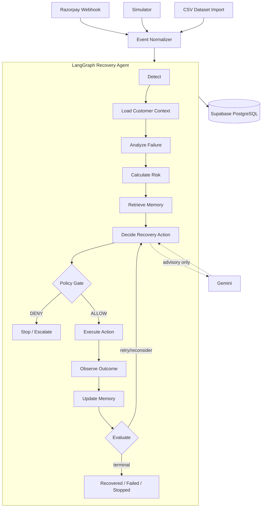

# Recovr — Autonomous AI Revenue Recovery Agent

[](https://nextjs.org/)
[](https://langchain-ai.github.io/langgraphjs/)
[](https://ai.google.dev/)
[](https://supabase.com/)
[](https://razorpay.com/)
[](LICENSE)

**Recovr** detects failed payments, figures out why they failed, decides the single best (already financially-approved) way to try to recover the revenue, checks that a hard policy allows it, acts, watches what actually happens, and remembers it for next time — autonomously, but never unboundedly.

Built for the **Razorpay AI Buildathon 2026 — Track 03: AI Revenue Recovery**.

---

## Table of Contents

- [The Problem](#the-problem)
- [The Solution](#the-solution)
- [Architecture](#architecture)
- [AI / Agent Architecture](#ai--agent-architecture)
- [Features](#features)
- [Local vs. Production](#local-vs-production)
- [Environment Variables](#environment-variables)
- [Local Setup](#local-setup)
- [Production Deployment](#production-deployment)
- [Demo / Jury Walkthrough (5 Minutes)](#demo--jury-walkthrough-5-minutes)
- [API / Routes](#api--routes)
- [Testing](#testing)
- [Security](#security)
- [Limitations / Future Work](#limitations--future-work)

---

## The Problem

Every subscription and e-commerce business loses real revenue to failed payments: expired cards, insufficient funds, gateway timeouts, abandoned checkouts. The typical response is a blunt dunning script — retry blindly on a fixed schedule, email everyone the same message, and hope. That approach:

- retries payments that were never going to succeed (permanent declines, closed accounts),
- contacts the same customer too many times and burns goodwill (fatigue),
- has no memory of what actually worked for a given customer last time,
- and gives no auditable reasoning for why an action was taken.

## The Solution

Recovr treats each failed payment as a case for an **autonomous agent** to work, bounded by deterministic financial rules it can never override:

1. **Detect** — a payment fails, via a real Razorpay webhook, the simulator, or a CSV import — all three become the same normalized event.
2. **Analyze** — classify the failure (temporary / behavioral / permanent / abandonment); Gemini adds a plain-English root-cause note but cannot change the classification.
3. **Score** — compute recovery probability and priority from the customer's real payment history — pure math, no AI.
4. **Recall memory** — look up this customer's own past outcomes with each strategy, and category-wide success rates.
5. **Decide** — pick from a pre-computed, financially-safe candidate list (Net Expected Value per action). Memory can re-rank it; Gemini, when available, picks among the same safe options and explains why.
6. **Policy gate** — deterministic guardrails (retry caps, cooldowns, contact limits, margin protection, customer-fatigue limits, approval thresholds) can only **ALLOW** or **DENY**. Nothing upstream, including the LLM, can bypass it.
7. **Execute** — call exactly one bounded tool to act (retry the charge, send a payment link, notify the customer, escalate to a human, or record a no-op).
8. **Observe** — read back what actually happened: recovered, failed, or dispatched-and-awaiting-the-customer.
9. **Learn** — write the real outcome to long-term memory so the next decision for this customer is informed by it.
10. **Resume / escalate / stop** — a dispatched action pauses and resumes later via the same checkpointed thread; a high-value or policy-blocked case escalates to a human instead of executing further; every case terminates in a labeled, auditable state.

## Architecture



- **Deterministic logic controls money**: risk scoring, Net Expected Value, policy/guardrails, and execution are pure, testable code — never the LLM.
- **Gemini provides bounded AI reasoning**: a root-cause explanation, and a pick among a pre-approved candidate list. It cannot invent an action, a retry count, an amount, or a URL.
- **LangGraph orchestrates the workflow** as an explicit, bounded state machine (fixed edges, a recursion limit, and business-level max-attempts/max-iterations counters) — not an open-ended agent loop.
- **PostgreSQL (Supabase)** is the single production datastore for business data, long-term agent memory, and LangGraph checkpoint state.
- **Ollama** is used for local development only. Production never depends on it.
- **Razorpay Test Mode** provides the real payment-gateway integration (orders, payment links, webhooks).

## AI / Agent Architecture

| Concern | Mechanism |
|---|---|
| Orchestration | [LangGraph](https://langchain-ai.github.io/langgraphjs/) `StateGraph` — 11 fixed nodes, 2 conditional edges, a `recursionLimit`, and state-level `max_attempts`/`max_iterations` |
| AI reasoning (production) | Google **Gemini** (`@langchain/google-genai`), selected via `LLM_PROVIDER=gemini` |
| AI reasoning (local dev) | **Ollama** (`@langchain/ollama`), the default when `LLM_PROVIDER` is unset |
| Deterministic safety | `lib/engine/decider.js` (NEV), `lib/engine/guardrails.js` (policy), `lib/agent/tools/actionExecutor.js` (execution) |
| Short-term memory | LangGraph checkpoints — PostgreSQL (`@langchain/langgraph-checkpoint-postgres`) in production, SQLite locally |
| Long-term memory | `lib/memory/` — a `pgMemory.js` adapter (Postgres, production) or `sqliteMemory.js` (local), behind one `memoryService.js` interface |
| Stopping rules | Bounded retry/iteration counts, `recovered`/`stopped`/`escalated` terminal states, human-approval thresholds |

**What the LLM can never do:** move money, override a policy decision, invent a recovery action outside the pre-computed candidate list, set its own retry count, call an arbitrary URL, or execute code. `analyzeFailure.js` and `decideRecoveryAction.js` validate every LLM response against a closed Zod schema and silently fall back to the deterministic pipeline on any invalid response, timeout, or unreachable provider — an unavailable or malformed LLM response never blocks or corrupts a decision, it just removes the AI-assisted layer for that step.

## Features

- Revenue recovery **dashboard** — at-risk revenue, recovered revenue, revenue vs. case recovery rate, strategy effectiveness, escalations/stopped/paused counts, all computed from persisted records.
- **One-click Revenue Recovery Demo** — seeds and processes a batch of cases through the real agent and populates the dashboard.
- **Recovery cases** list and **case detail** pages with a full autonomous-agent decision timeline (deterministic vs. AI-assisted steps clearly tagged).
- **Simulator** (`/simulator`) — inject realistic failure scenarios, run a single case through the agent, or run a batch.
- **Razorpay integration** — Test Mode checkout, orders, and an idempotent `payment.failed` / `payment.captured` webhook.
- **CSV dataset import** (`/analyze`) — upload a business CSV (or use a bundled sample), validate it, preview it, and run it through the *same* LangGraph agent as any other event source.
- **Batch recovery simulation** with clearly labeled simulated outcomes.
- **Long-term agent memory** that measurably changes a later decision for a repeat customer.
- **Checkpoint / resume** — a dispatched-but-unconfirmed action pauses and resumes later on the same thread, with counters preserved.
- **Policy & guardrails** — retry caps, cooldowns, contact limits, margin protection, customer fatigue, approval thresholds, expiry handling.
- **Strategy effectiveness analytics** and a naive-baseline comparison for measuring incremental value.
- **Full audit trail** — every decision, policy check, and action is logged immutably.

## Local vs. Production

| | Local development | Production (Vercel) |
|---|---|---|
| App | `next dev` | Vercel serverless functions |
| Orchestration | LangGraph | LangGraph (identical code) |
| AI reasoning | Ollama (`LLM_PROVIDER` unset or `ollama`) | Gemini (`LLM_PROVIDER=gemini`) |
| Business data | SQLite (`data/revenue_recovery.db`) or Postgres if `DATABASE_URL` is set | Supabase PostgreSQL (`DATABASE_URL` required) |
| Agent memory | SQLite (`data/agent_memory.db`) | Same Postgres instance, `agent_memory` table |
| Agent checkpoints | SQLite (`data/agent_checkpoints.db`) | Same Postgres instance, via `@langchain/langgraph-checkpoint-postgres` |
| Payments | Razorpay Test Mode or the built-in simulator | Razorpay Test Mode |

Production never depends on `localhost:11434` (Ollama) or a local SQLite file — the storage and LLM boundaries are selected entirely by `DATABASE_URL` and `LLM_PROVIDER` at runtime, with no code path that can reach a developer's machine.

## Environment Variables

Never commit real values — copy `.env.example` to `.env.local` and fill in your own.

| Variable | Required | Where | Purpose |
|---|---|---|---|
| `DATABASE_URL` | **Yes, production** | Server only | Supabase/PostgreSQL connection string. Use the **pooled** ("Transaction pooler") connection string from Supabase's dashboard, not the direct-connection one — mixing a direct host with a pooler port is a common cause of `password authentication failed`. |
| `RECOVERY_ENGINE` | Recommended | Server only | `agent` routes `payment.failed` events through the LangGraph agent; unset/anything else keeps the original deterministic pipeline. |
| `LLM_PROVIDER` | **Yes, production** | Server only | `gemini` in production, `ollama` (or unset) locally. |
| `GEMINI_API_KEY` | Required when `LLM_PROVIDER=gemini` | Server only | Google Gemini API key. Never sent to the client. |
| `GEMINI_MODEL` | Optional | Server only | e.g. `GEMINI_MODEL=gemini-3.6-flash`. Defaults to a fast Gemini model if unset. |
| `OLLAMA_BASE_URL` | Local only | Server only | Defaults to `http://localhost:11434`. Ignored when `LLM_PROVIDER=gemini`. |
| `OLLAMA_MODEL` | Local only | Server only | Defaults to `llama3.1`. Ignored when `LLM_PROVIDER=gemini`. |
| `RAZORPAY_KEY_ID` | Yes | Server only | Razorpay **Test Mode** key id. |
| `RAZORPAY_KEY_SECRET` | Yes | Server only | Razorpay **Test Mode** key secret. |
| `RAZORPAY_WEBHOOK_SECRET` | Yes | Server only | Used to verify webhook signatures — never logged. |
| `AGENT_MEMORY_DB_PATH` | Local only | Server only | Where local SQLite agent memory lives; ignored when `DATABASE_URL` is set. |
| `AGENT_CHECKPOINT_DB_PATH` | Local only | Server only | Where local SQLite checkpoints live; ignored when `DATABASE_URL` is set. |
| `AGENT_RECHECK_DELAY_MS` | Optional | Server only | How long a paused action waits before the cron sweep reconsiders it (default 30 min). |
| `ALLOW_DESTRUCTIVE_RESET` | Optional, **leave unset in production** | Server only | Must be explicitly `"true"` for the simulator's reset/reseed to run against a PostgreSQL `DATABASE_URL` — a safeguard against ever truncating a real database from the demo UI. |

`NEXT_PUBLIC_RAZORPAY_KEY_ID` exists in `.env.example` for a future client-side Razorpay Checkout popup but is not read by any current code path — it is not required.

## Local Setup

```bash
git clone https://github.com/vishuweb/revenue_recovery_agent.git
cd revenue_recovery_agent

npm install

cp .env.example .env.local
# edit .env.local: at minimum, Razorpay Test Mode keys.
# Leave DATABASE_URL unset to use local SQLite (created automatically under data/).

# Optional — for AI-assisted reasoning locally (otherwise the agent
# falls back to deterministic reasoning automatically):
ollama serve
ollama pull llama3.1

npm run dev
```

Open [http://localhost:3000](http://localhost:3000). No database migration step is needed locally — SQLite schema is created and migrated automatically on first use.

## Production Deployment

1. Provision a Supabase (or any PostgreSQL) database.
2. In Vercel's project settings, add: `DATABASE_URL` (pooled connection string), `LLM_PROVIDER=gemini`, `GEMINI_API_KEY`, `GEMINI_MODEL`, `RAZORPAY_KEY_ID`, `RAZORPAY_KEY_SECRET`, `RAZORPAY_WEBHOOK_SECRET`, `RECOVERY_ENGINE=agent`.
3. Deploy (`vercel --prod` or a connected Git push).
4. Verify: open the deployed dashboard, confirm `/api/dashboard` returns data (not a database error), and run the one-click demo once.
5. Point your Razorpay webhook at `https://<your-domain>/api/webhooks`.

Production requires PostgreSQL and Gemini — there is no supported production configuration that depends on local Ollama or a local SQLite file.

## Demo / Jury Walkthrough (5 Minutes)

1. Open the **dashboard** — note revenue at risk and the "Autonomous Agent" panel.
2. Click **Run Revenue Recovery Demo** and watch the metrics populate.
3. Point out **Revenue Recovery Rate** vs. **Case Recovery Rate**, and the strategy-effectiveness table.
4. Open one **recovered case** — walk through the agent decision timeline: detection → analysis → risk → memory → decision → policy → action → outcome.
5. Highlight one step tagged **AI-assisted** and read its (Gemini-generated) reasoning aloud.
6. Show a case where **policy blocked** an action (retry cooldown, fatigue cap, or an amount above the approval threshold requiring escalation) — the agent recommended, policy said no, nothing executed.
7. Open a **repeat customer**'s second case and show the "previous recovery outcome influenced this decision" callout with real before/after probabilities.
8. Go to **/simulator**, trigger a scenario, and show it land on the dashboard/cases list immediately.
9. *(Optional)* Go to **/analyze**, download the sample CSV, upload it back, and run it — showing the identical agent processing an externally-sourced dataset.

## API / Routes

| Route | Method(s) | Purpose |
|---|---|---|
| `/api/dashboard` | `GET` | Aggregate dashboard metrics |
| `/api/agent/run` | `POST` | Run a single payment through the LangGraph agent |
| `/api/agent/batch` | `POST` | Run a batch of cases through the agent (the one-click demo) |
| `/api/agent/metrics` | `GET` | Agent-specific dashboard metrics |
| `/api/agent/strategies` | `GET` | Strategy effectiveness analytics |
| `/api/agent/cases/[id]` | `GET` | Agent decision timeline for one case |
| `/api/agent/resume` | `POST` | Force-resume paused agent cases |
| `/api/cases` | `GET`, `POST` | List / create recovery cases |
| `/api/cases/[id]` | `GET`, `PATCH` | Case detail / manual operator action |
| `/api/cases/[id]/actions` | `POST` | Record or execute a recovery action |
| `/api/webhooks` | `POST` | Razorpay webhook (`payment.failed`, `payment.captured`, signature-verified, idempotent) |
| `/api/webhooks/simulate` | `POST` | Simulated webhook (same normalized-event pipeline) |
| `/api/events` | `POST` | Ingest business events (e.g. checkout abandonment) |
| `/api/simulator` | `POST` | Simulator scenario triggers and seeding |
| `/api/dataset/parse` | `POST` | Parse and validate an uploaded CSV, return a preview |
| `/api/dataset/run` | `POST` | Run a validated CSV dataset through the agent |
| `/api/dataset/runs`, `/api/dataset/runs/[id]` | `GET` | List / inspect past dataset runs |
| `/api/customers`, `/api/customers/[id]` | `GET` | Customer list / detail |
| `/api/razorpay/order`, `/api/razorpay/verify` | `POST` | Razorpay Test Mode checkout order + signature verification |
| `/api/cron` | `GET` | Background sweep — resumes due paused cases and processes scheduled retries |
| `/api/audit` | `GET` | Immutable audit log |

## Testing

```bash
npm test        # engine + agent unit tests, then a comprehensive end-to-end script
npm run build   # production build
```

`npm test` always runs against a disposable local SQLite database and the built-in payment simulator — regardless of what `DATABASE_URL`/Razorpay keys are set in your `.env.local` — so it can never touch a real Supabase instance or make a real Razorpay API call (see `scripts/force-local-test-db.mjs`).

Additional scripts:
```bash
npm run test:unit    # engine + agent tests only, skip the end-to-end script
npm run test:agent   # agent tests only
npm run test:ollama  # live smoke test against a real local Ollama instance
```

## Security

- All secrets (`DATABASE_URL`, `GEMINI_API_KEY`, `RAZORPAY_KEY_SECRET`, `RAZORPAY_WEBHOOK_SECRET`) are read server-side only and are never exported to client-side code or logged.
- Razorpay webhook signatures are verified before any event is processed.
- Every financial action passes through a deterministic policy gate the LLM cannot influence or bypass.
- The demo's destructive reset/reseed is blocked outright against a PostgreSQL `DATABASE_URL` unless `ALLOW_DESTRUCTIVE_RESET=true` is explicitly set — a production database can't be truncated from the UI by default.
- Uploaded CSV data is validated (row limits, required fields, numeric/duplicate checks) before it reaches the agent; nothing in a CSV is executed as code.
- No secrets are committed to this repository — see `.gitignore` for `.env*`, `*.db`, and local data files.

## Limitations / Future Work

- **AI attribution is advisory, not causal**: "assisted" recovery attribution is a reasonable heuristic (an intervention was executed before the payment succeeded), not a rigorously proven causal claim — a naive-baseline comparison is shown alongside it for honesty, not certainty.
- **Batch runs skip live AI reasoning** by design (`llmEnabled: false`) so processing 100+ cases stays fast and doesn't depend on a model being reachable; only individually-run cases demonstrate live Gemini/Ollama reasoning.
- **Production database connectivity depends on using Supabase's pooled connection string correctly** — a direct-connection host paired with the pooler port (or vice versa) fails authentication even with the correct password; see the `DATABASE_URL` note above.
- **No hosted hard requirement on hitting Gemini every request** — if `GEMINI_API_KEY`/`LLM_PROVIDER` are misconfigured, the agent fails over to deterministic reasoning safely and silently; this is intentional (fail-safe over fail-loud for financial actions), but it means an AI misconfiguration will not surface as an obvious error to an operator without checking the case timeline's "AI-assisted" tags.
- **CSV import assumes a single normalized schema**; unusual column layouts rely on the auto-mapping heuristics in `lib/dataset/parser.js` rather than a guaranteed-correct mapping.

---

Distributed under the **MIT License**. See [`LICENSE`](LICENSE).
